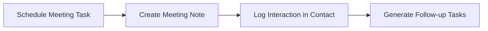
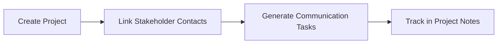
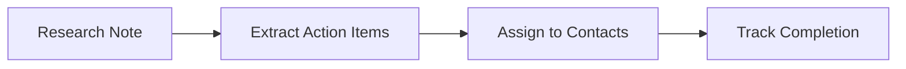

# Denote Ecosystem Vision

## Executive Summary

The Denote ecosystem consists of three specialized TUI applications that use Denote's file naming convention and Markdown format as a unified data layer. This creates a decentralized, file-based personal information management system where notes, tasks, and contacts coexist as plain text files.

## Core Philosophy

### Single-Purpose Tools

Each application focuses on one domain:

- **notes-tui**: Note-taking and knowledge management
- **denote-tasks**: Task and project management
- **denote-contacts**: Contact and relationship management

### Unified Data Layer

All applications:

- Share a common directory of Markdown files
- Use consistent file naming: `YYYYMMDD--title__tag.md`
- Store metadata in YAML frontmatter
- Enable cross-references through Denote links

### Plain Text Sustainability

- No proprietary formats or databases
- Version control friendly
- Platform independent
- Future-proof data storage

## Architecture Overview

```
~/Documents/denote/
├── 20250101--project-alpha-kickoff__note.md
├── 20250102--implement-authentication__task.md
├── 20250103--sarah-chen__contact.md
├── 20250104--weekly-review__note.md
├── 20250105--call-mom__task.md
└── 20250106--john-smith__contact.md
```

## Application Profiles

### notes-tui

**Purpose**: Capture and organize thoughts, meeting notes, documentation

**Key Features**:

- Rapid note creation with automatic timestamps
- Full-text search across all notes
- Tag-based organization
- Markdown editing with live preview
- Template support for common note types

**Denote Integration**:

- Creates files with `_note` tag
- Can reference tasks and contacts
- Supports project tags for grouping

### denote-tasks

**Purpose**: Manage tasks, projects, and deadlines

**Key Features**:

- Task creation with priority and due dates
- Project hierarchy and dependencies
- Kanban-style board view
- Time tracking and estimates
- Recurring task support

**Denote Integration**:

- Creates files with `_task` tag
- Links tasks to contacts for accountability
- References notes for context
- Project files with `_project` tag

### denote-contacts

**Purpose**: Maintain relationships and track interactions

**Key Features**:

- Contact profiles with interaction history
- Relationship type categorization
- Follow-up reminders based on contact frequency
- Interaction logging (calls, emails, meetings)
- Export to various formats

**Denote Integration**:

- Creates files with `_contact` tag
- Generates tasks for follow-ups
- Links to meeting notes
- Supports contact groups via tags

## Cross-Application Workflows

### 1. Meeting Workflow



1. Create task in denote-tasks: "Meeting with Sarah Chen"
2. During meeting, create note in notes-tui
3. After meeting, log interaction in denote-contacts
4. System generates follow-up tasks automatically

### 2. Project Stakeholder Management



1. Create project file with stakeholder list
2. Link to relevant contact files
3. Generate regular check-in tasks
4. Document progress in project notes

### 3. Knowledge Management



1. Capture research in notes-tui
2. Extract actionable items as tasks
3. Assign tasks to relevant contacts
4. Track implementation progress

## Technical Implementation

### File Format Standardization

**Base Frontmatter Fields**:

```yaml
---
title: string
date: YYYY-MM-DD
tags: [primary_tag, ...]
identifier: YYYYMMDD
---
```

**Cross-Reference Fields**:

```yaml
related_notes: [YYYYMMDD, ...]
related_tasks: [YYYYMMDD, ...]
related_contacts: [YYYYMMDD, ...]
related_projects: [YYYYMMDD, ...]
```

### Tag Taxonomy

**Primary Tags** (mutually exclusive):

- `_note`: General notes and documentation
- `_task`: Actionable items with status
- `_contact`: People and organizations
- `_project`: Project containers

**Secondary Tags** (combinable):

- Content: `meeting`, `idea`, `reference`, `journal`
- Context: `@home`, `@work`, `@phone`, `@computer`
- Projects: `project-alpha`, `project-beta`
- Areas: `family`, `health`, `finance`, `career`

### Search and Filter Capabilities

Each application can:

1. Search across all files regardless of type
2. Filter to show only relevant file types
3. Follow cross-references to related content
4. Display inline previews of linked content

## Benefits

### For Users

1. **Unified Information Space**
   - All information in one searchable location
   - Natural connections between different types of data
   - No context switching between applications

2. **Data Ownership**
   - Complete control over your data
   - No vendor lock-in
   - Easy backup and synchronization

3. **Flexibility**
   - Use one, two, or all three applications
   - Mix with other Denote-compatible tools
   - Customize with scripts and automation

### For Developers

1. **Clear Boundaries**
   - Each app has a focused scope
   - Well-defined interfaces between apps
   - Easier to maintain and enhance

2. **Shared Standards**
   - Common file format reduces duplication
   - Reusable parsing and writing code
   - Consistent user experience

3. **Extensibility**
   - Easy to add new applications to ecosystem
   - Plugin architecture for custom features
   - API for third-party integrations

## Future Roadmap

### Phase 1: Foundation (Current)

- [x] Basic contacts-tui with SQLite backend
- [x] Denote export functionality
- [ ] denote-contacts with native Denote storage
- [ ] denote-tasks MVP
- [ ] Cross-reference support in notes-tui

### Phase 2: Integration

- [ ] Unified search across all applications
- [ ] Automated task generation from contacts
- [ ] Project template system
- [ ] Mobile companion apps

### Phase 3: Intelligence

- [ ] Smart follow-up suggestions
- [ ] Relationship health metrics
- [ ] Natural language task creation
- [ ] AI-assisted note organization

### Phase 4: Collaboration

- [ ] Shared project spaces
- [ ] Encrypted file sync
- [ ] Team task management
- [ ] Public note publishing

## Design Principles

1. **Fast and Keyboard-Driven**
   - All common operations accessible via shortcuts
   - Minimal latency for all actions
   - Efficient navigation between items

2. **Progressive Disclosure**
   - Simple interface for basic usage
   - Advanced features available when needed
   - Contextual help and documentation

3. **Fail Gracefully**
   - Each app works independently
   - Missing cross-references handled safely
   - Clear error messages and recovery

4. **Respect User Habits**
   - Don't force specific workflows
   - Allow customization of key bindings
   - Support different organization styles

## Documentation

- Comprehensive user guides
- Developer API documentation
- Example workflows and templates
